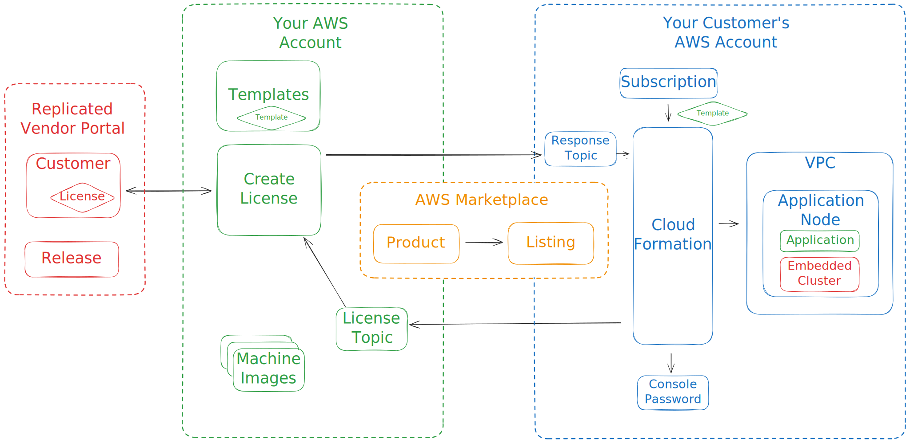

# Replicated Cluster Cloudformation Demo
   
Implements a CloudFormation template the manages a Replicated installation
using the Embedded Cluster and a new license specific to the cluster.

Architecture
------------

This repo is designed to support shipping a product with the AWS Marketplace.
The overall architecture includes components that exist in the vendor account,
marketplace artifacts, and eventual delivered infrastructure/software in the
end customer account.

Details
-------

Uses Terraform and Python to implement a CloudFormation template that manages
a Replicated customer and an instance of your application running with the
Replicated Embedded Cluster. This is the foundation for creating an AWS
Marketplace product that is distributed with Replicated. The cluster created
is a single node based a [AMI including the Replicated Embedded Cluster binary
for the application](crdant/embedded-cluster-ami).

The license is handled as a custom resource in CloudFormation. It uses
the Replicated customer ID as the resource ID to facilitate managing the
lifecycle of the customer entirely within CloudFormation. The template
invokes a lambda function to manage the custom resource.

The lambda function is written in Python and is invoked via an SNS topic to
allow it to run in the software vendor's AWS account. Their is a class
`Customer` that manages the customer and uses the [Replicated Vendor Portal
API](https://replicated-vendor-api.readme.io/reference) to create, load, and
delete customers. Update is not yet implemented.

The CloudFormation template is stored in an S3 bucket so it's available
for creating new stacks. The S3 bucket and the lambda function are both
managed with Terraform, along with a role and policy for the stack
execution.

This template has been used to publish [SlackerNews](https://slackernews.io)
as an AWS Marketplace product.

Usage
-----

Uses `make all` to create the necessary assets. It will prompt you for the id
for your application on the [Vendor Portal](https://vendor.replicated.com). If
you don't know it, you can find it with either `replicated app ls` or by going 
to the [Vendor Portal](https://vendor.replicated.com) and looking at the 
settings for you application. Be sure to use the ID and not the slug.

You can then go to the [AWS Console](https://console.aws.amazon.com) and create
a CloudFormation stack using the deployed template. The template URL will be
in the Terraform output.

## Makefile reference

| target | purpose |
|--------|----------|
| all     | create the lambda function for the custom resource and store the CloudFormation template in s3, same a `deploy` |
| deploy  | create the lambda function for the custom resource and store the CloudFormation template in s3, same a `all` |
| pepare  | prepares a build directory and copies the lambda source files into it |
| package | package the lambda function and it's dependencies into a zip file for deployment |
| plan    | runs terraform plan to validate the terraform manifests and understand what `deploy` will create |
| destroy | removes all the AWS resources |
| clean   | cleans up the build directory |

